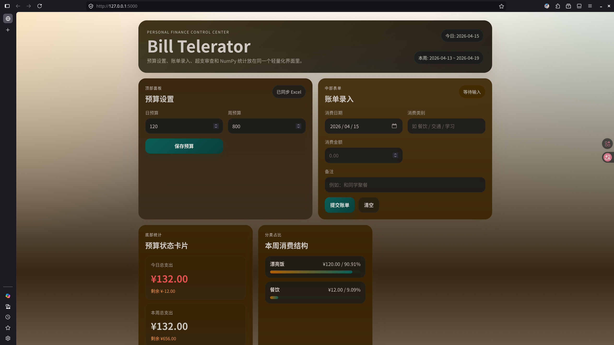
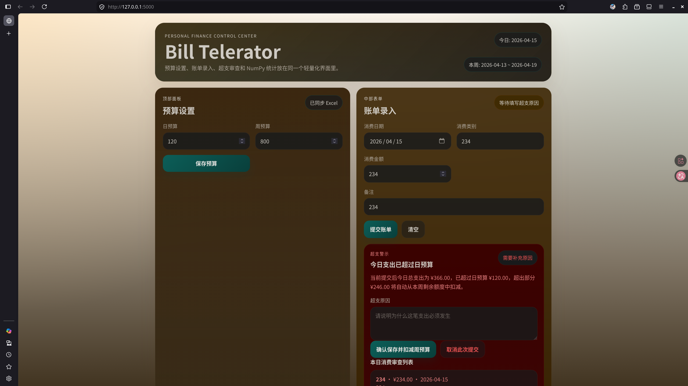

```plaintext
下面是我的本次vibe coding作业，我选择你为我完成整个项目。我的工作区在/home/pylorsun/Documents/Study/2025-2026第二学期/PythonAyz/Code/wks/bill_telerator ，这意味着你需要将文件及其改动限定在此目录下。
我的需求如下：
1. 项目背景

你将扮演一名全栈数据开发工程师的角色。客户（也就是你的老师）需要一个轻量级的个人财务管理系统。该系统不仅要有可视化的操作界面，还要具备强大的数据分析能力，并且数据必须持久化存储。

核心挑战：你需要将 Web 前端技术、Python 后端逻辑、NumPy 科学计算以及Excel 数据存储完美结合。

2. 技术栈要求

    前端：HTML5 + CSS3 + JavaScript (原生或 jQuery)
    后端：Python 3.x (推荐使用 Flask  框架)
    核心计算库：NumPy (严禁使用原生循环进行求和、筛选，必须使用向量化运算)
    数据存储：本地 Excel 文件 (.xlsx)，使用 pandas 进行读写
    开发工具：Trae (用于辅助编程、调试和代码生成)

3. 功能模块详解

你需要完成以下三个核心模块的开发：

模块一：数据持久化层

    Excel 交互：程序启动时，自动读取 bills_data.xlsx。如果文件不存在，自动创建包含 bills（账单）和 settings（设置）两个 Sheet 的文件。
    数据读写：所有的账单录入和预算修改，必须实时写入 Excel，确保重启程序后数据不丢失。

模块二：后端逻辑与 NumPy 计算

    数据结构：从 Excel 读取数据后，必须转换为 NumPy 数组 进行处理。
    预警算法：
        利用 np.sum() 计算今日/本周总支出。
        利用布尔索引（如 arr[arr > threshold]）筛选超支记录。
    超支惩罚机制：
        当 今日支出 > 日预算 时，触发逻辑。
        强制要求录入“超支原因”。
        自动从 周预算 剩余额度中扣除相应金额。

模块三：Web 前端交互

    界面布局：
        顶部：预算设置面板。
        中部：账单录入表单（类别、金额、备注）。
        底部：数据可视化表格（显示历史账单）和统计卡片（剩余预算、分类占比）。
    动态反馈：
        使用 JavaScript 的 fetch 或 XMLHttpRequest 与后端通信。
        超支时，界面需弹出红色警示框，并动态插入“输入原因”的输入框，在此输入框下面也要列出本日所有消费的列表供用户审查。
```

```plaintext
继续此前的工作。我已经手动把pandas安装上了。但是因为TUN原因，你断线了。
```

```plaintext
好的，现在需要你为我改进整个UI：将警告独立成单个窗口，紧凑顶部面板和中部表单，并将预算状态卡片和本周消费结构做成滚动形式。标题背景与提示语句删除。
主要是，你需要想办法优化整个系统的操作逻辑与UI表现，至少把所有元素放进一个"100% 渲染高度"中。现在的表现如图1所示——你看，下面的东西戛然而止。超支提示如图2所示，这也很不合适。


```

```plaintext
继续工作。刚刚断线了。
```

```plaintext

```
